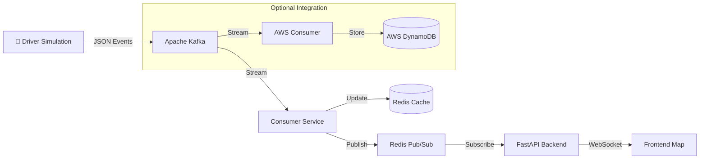

# 🚖 Real-Time Cab Location Tracker


A high-performance, real-time system that simulates and tracks cab locations using event-driven architecture. This project demonstrates the power of **Apache Kafka** for data streaming, **Redis** for caching and Pub/Sub, and **WebSockets** for live frontend updates.

## 🏗️ Architecture

The system follows a modern event-driven pipeline:



## 🚀 Tech Stack

-   **Core**: Python 3.12+
-   **Streaming**: Apache Kafka (running in Docker)
-   **Cache & Pub/Sub**: Redis (running in Docker)
-   **Backend**: FastAPI (High-performance Async API)
-   **Frontend**: HTML5, JavaScript, Leaflet.js (OpenStreetMap)
-   **Cloud**: AWS DynamoDB (NoSQL Storage)
-   **Infrastructure**: Docker & Docker Compose

## 🛠️ Prerequisites

Before running the project, ensure you have the following installed:

1.  **Docker Desktop** (Must be running)
2.  **Python 3.10+**
3.  **Git**

## ⚡ Quick Start

I have automated the entire setup process. You don't need to manually install dependencies or open multiple terminals.

1.  **Clone the Repository**
    ```bash
    git clone https://github.com/Santhosh132-ops/Cab-location-Events-.git
    cd Cab-location-Events-
    ```

2.  **Run the Project (One-Click)**
    Run the automation script in PowerShell:
    ```powershell
    .\run_project.ps1
    ```

    **What this script does:**
    -   ✅ Checks/Creates a Python Virtual Environment.
    -   ✅ Installs all dependencies (`kafka-python-ng`, `fastapi`, `redis`, etc.).
    -   ✅ Starts Docker containers (Kafka, Zookeeper, Redis).
    -   ✅ Launches the **Backend API**, **Consumer**, and **Producer** in separate windows.
    -   ✅ Opens the **Live Map** in your default browser.

## 📂 Project Structure

```text
cab-location-tracker/
├── backend/                # FastAPI Backend
│   └── main.py            # WebSocket Endpoint
├── consumer/               # Kafka Consumers
│   ├── main.py            # Core Consumer (Redis)
│   └── dynamodb_consumer.py # AWS Consumer
├── producer/               # Data Generator
│   └── main.py            # Simulates Driver GPS
├── frontend/               # User Interface
│   └── index.html         # Leaflet Map
├── docker-compose.yml      # Infrastructure Config
├── run_project.ps1         # Automation Script
└── requirements.txt        # Dependencies
```

## ☁️ AWS Integration (Optional)

To save location history to the cloud:

1.  Configure your AWS Credentials (`aws configure`).
2.  Create a DynamoDB table named `CabLocations`.
3.  Run the AWS Consumer:
    ```bash
    python consumer/dynamodb_consumer.py
    ```
    *See `aws_setup.md` for detailed instructions.*

## 🤝 Contributing

Feel free to fork this repository and submit Pull Requests.

---
*Built for learning Event-Driven Architectures.*
